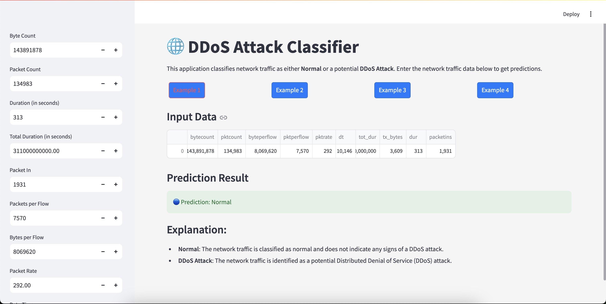

# DDoS Classification App

This project implements machine learning algorithms to classify DDoS attacks. The app is built using Streamlit for a user-friendly interface, allowing users to interactively predict whether network traffic is benign or malicious.

## Table of Contents
- [Project Overview](#project-overview)
- [DDoS Classification ML Comparison Notebook](#ddos-classification-ml-comparison-notebook)
- [Prerequisites](#prerequisites)
- [Setup Instructions](#setup-instructions)
- [Running the App](#running-the-app)
- [Screenshots](#screenshots)
- [Requirements](#requirements)
- [License](#license)
- [Acknowledgements](#acknowledgements)

## Project Overview

This project implements machine learning techniques to classify network traffic and detect DDoS attacks using the provided SDN dataset. It includes comprehensive data preprocessing, feature selection, class balancing, and model evaluation.

### Key Libraries Used
- **Data Manipulation**: `pandas`, `numpy`
- **Visualization**: `matplotlib`, `seaborn`
- **Machine Learning**: `scikit-learn` for classifiers, `imblearn` for handling class imbalance
- **Feature Selection**: Utilizing Mutual Information, Chi-Square, and F-Test

### Workflow Summary
1. **Data Loading**: The dataset is loaded from a CSV file.
2. **Data Preprocessing**:
   - Handling missing values.
   - Encoding categorical features using `LabelEncoder`.
   - Scaling numerical features with `StandardScaler`.
3. **Feature Selection**:
   - Evaluate features based on Mutual Information, Chi-Square, and F-Test scores.
4. **Class Balancing**: Techniques like Random Oversampling, Random Undersampling, and SMOTE are applied to address class imbalance.
5. **Model Training & Evaluation**:
   - Models including K-Nearest Neighbors, Decision Trees, Random Forests, and SVM are trained and evaluated.
   - Performance metrics such as precision, recall, and F1-score are reported.
   - Confusion matrices and ROC curves are generated for detailed analysis.

## DDoS Classification ML Comparison Notebook

The `ddos_classification_ml_comparison.ipynb` notebook provides a comprehensive comparison of various machine learning algorithms for classifying DDoS attacks using the SDN dataset. This notebook is designed to evaluate the performance of different classifiers, analyze their effectiveness, and identify the best-performing model for DDoS detection.

### Key Features
- **Data Loading and Preprocessing**: Load the dataset and perform preprocessing steps.
- **Feature Selection**: Apply techniques like Mutual Information, Chi-Square, and F-Test.
- **Class Balancing Techniques**: Implement methods such as Random Oversampling, Random Undersampling, and SMOTE.
- **Model Evaluation**: Train and evaluate classifiers like KNN, Decision Trees, Random Forests, and SVM.
- **Performance Metrics**: Assess models using accuracy, precision, recall, F1-score, and AUC-ROC, with visualizations included.

### Usage
To use this notebook, ensure you have all the necessary libraries installed, then open the notebook in Jupyter or Google Colab and follow the step-by-step instructions to run each cell.

### Conclusion
The notebook serves as a valuable resource for understanding the capabilities of different machine learning algorithms in the context of DDoS attack detection.

## Prerequisites

Before you begin, ensure you have Python installed on your machine. You can download it from [python.org](https://www.python.org/downloads/).

## Setup Instructions

1. **Clone the Repository:** `git clone https://github.com/prabinkarki777/ddos-mlalgorithm.git && cd ddos-mlalgorithm`
2. **Create a Virtual Environment:** Create a virtual environment to isolate your project's dependencies. You can use `venv` or `conda`. Using venv: `python -m venv venv`. 
3. **Activate the Virtual Environment:** On Windows: `venv\Scripts\activate`, On macOS/Linux: `source venv/bin/activate`.
4. **Install Dependencies:** Use the `requirements.txt` file to install the necessary packages: `pip install -r requirements.txt`.

## Running the App

To run the Streamlit app, navigate to the project directory and use the following command: `streamlit run app.py`. This command will launch the app in your default web browser, where you can interact with the model and make predictions based on network traffic data.

## Screenshots

Here are some screenshots of the DDoS Classification App:

**Screenshot 1:**  

**Screenshot 2:**  

These screenshots display the interface and features of the app in action.

## Requirements

Ensure the following libraries are listed in your `requirements.txt`: `streamlit`, `pandas`, `numpy`, `scikit-learn`, `matplotlib`, `seaborn`. Feel free to add any additional libraries you are using in your project.

## License

This project is licensed under the MIT License - see the [LICENSE](LICENSE) file for details.

## Acknowledgements

- [Streamlit Documentation](https://docs.streamlit.io/)
- [Scikit-learn Documentation](https://scikit-learn.org/stable/)
